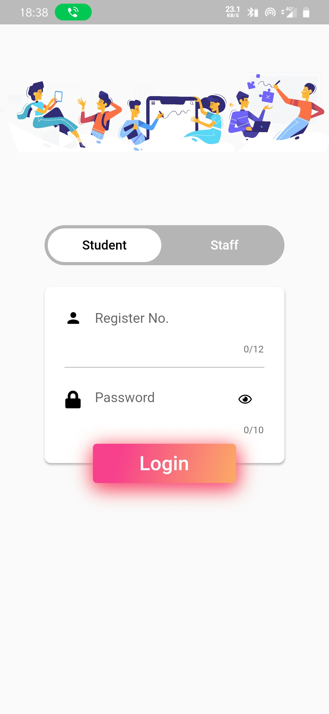
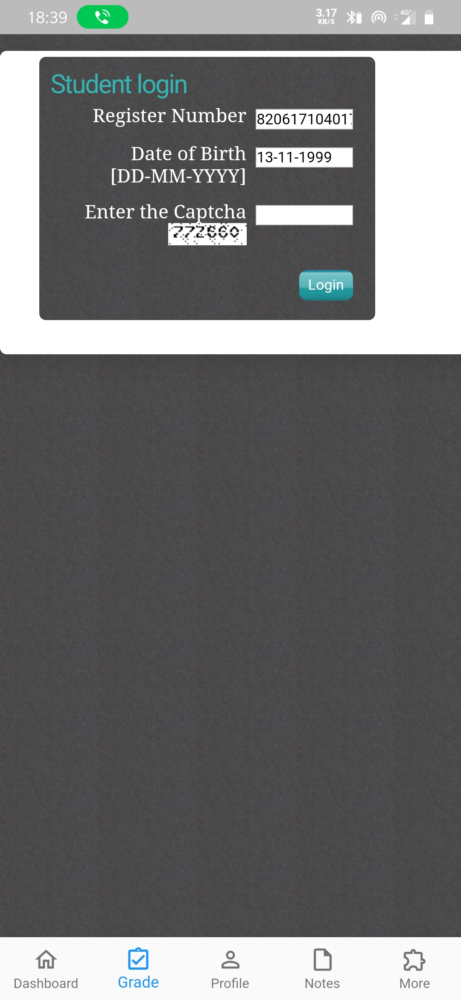
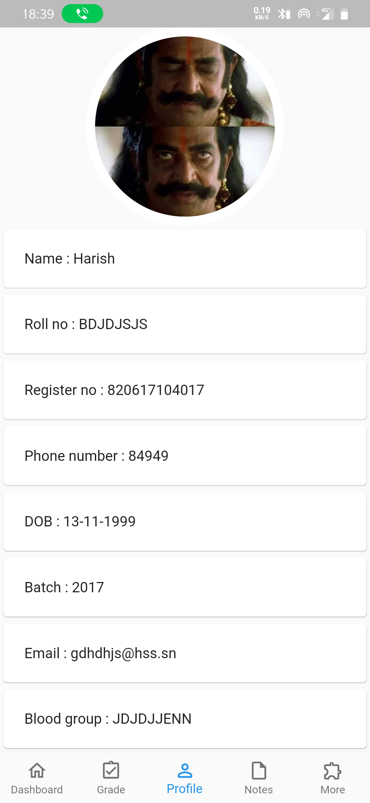
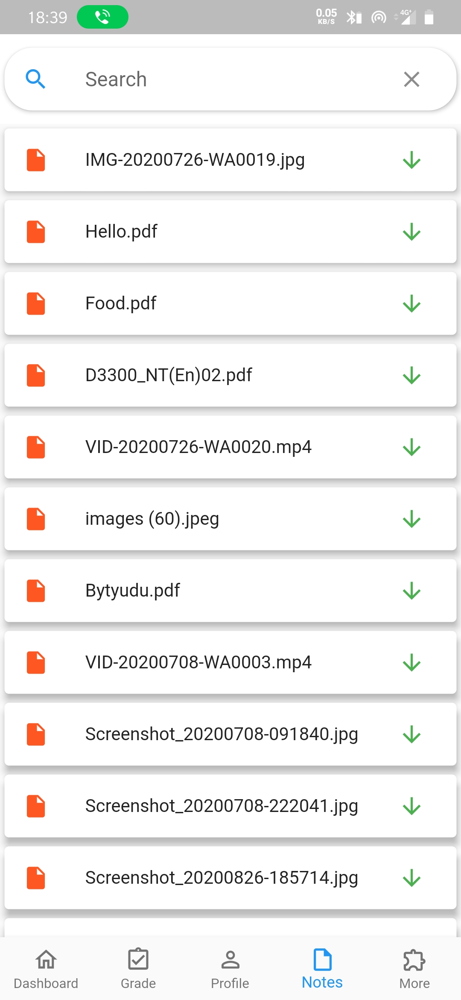
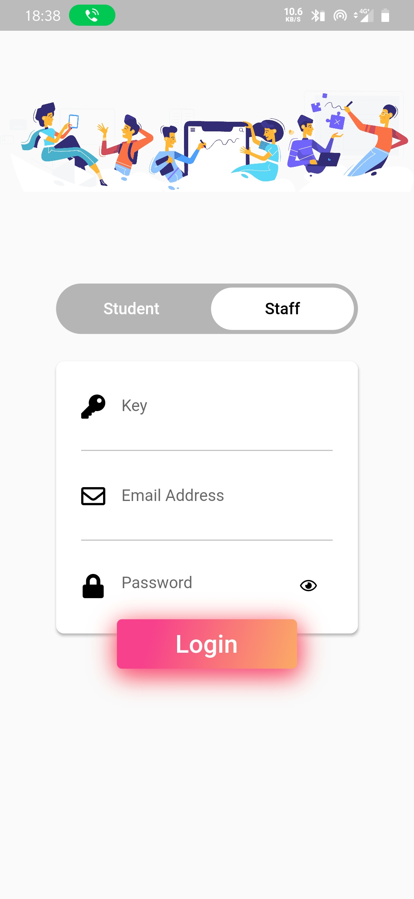
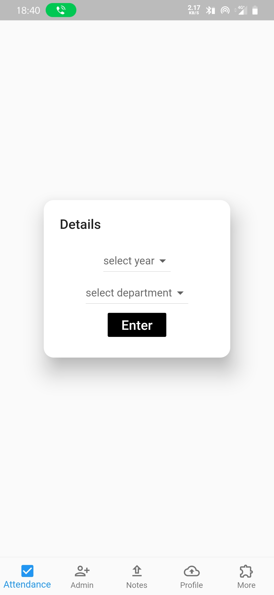
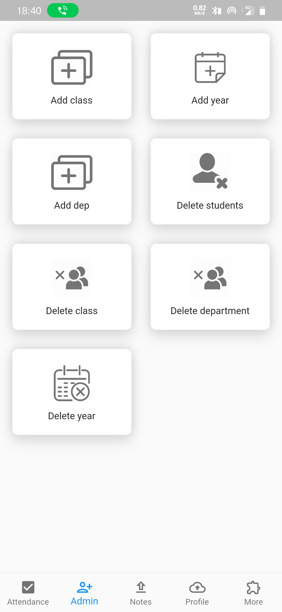
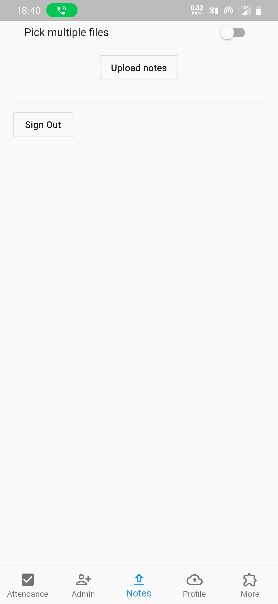
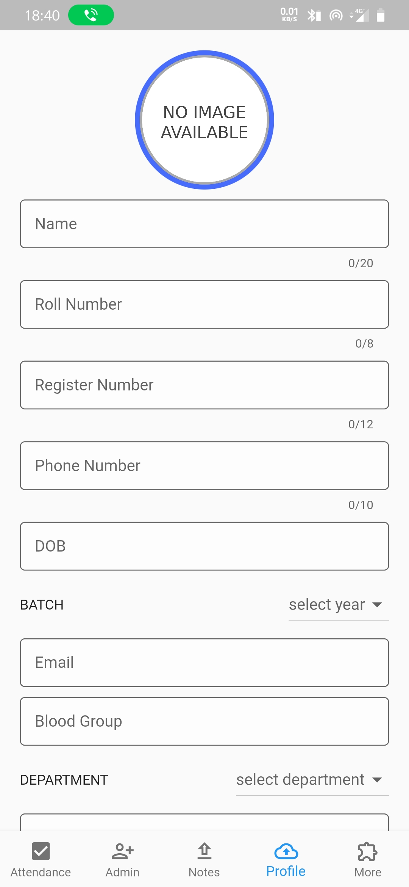

# Student app

## Make changes to branch(dev), not (main).

An app to digitalize the counselling class in a cross-platform application tested in android and web.

Check the live demo here: https://csekings.github.io/student_app_web/#/

## Credentials
Admin Credentials

key: ``csekings``
email: ``test@gmail.com``
password: ``test123``

Student credentials

register no: ``820617104017``
password: ``13-11-1999``

## Screenshots 
<table>
  <tr>
     <td>Student_login</td>
     <td>Dashboard</td>
     <td>Mark</td>
     <td>Profile</td>
     <td>Notes</td>
    
  </tr>
  <tr>
    <td></td>
    <td></td>
    <td></td>
    <td></td>
    <td></td>
     </tr>
 </table>

<table>
<tr>
     <td>Staff_login</td>
     <td>Attendance</td>
     <td>Admin</td>
     <td>Upload_notes</td>
     <td>Upload_Profile</td>
     
</tr>
<tr>
<td></td>
    <td></td>
    <td></td>
    <td></td>
    <td></td>
</tr>

</table>

## TODO
- [ ] Refactoring
- [ ] Redesign

## How to contribute
1. Fork the repository.
2. Make changes that you feel would not conflict with other modules.
3. Create a pull request mentioning what you did.
4. All requests will be accepted within 12 hrs.

## Submitting a issues
1. Make sure to test various devices before creating a ticket.
2. Specify the log and device descriptions. Otherwise, issue will be closed.

**Note: Android, iOS, Web is supported right now.**

Icons made by <a href="https://www.freepik.com" title="Freepik">Freepik</a> from <a href="https://www.flaticon.com/" title="Flaticon">www.flaticon.com</a>

